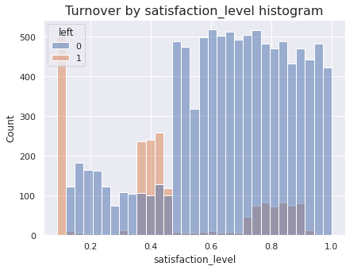
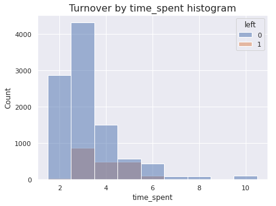
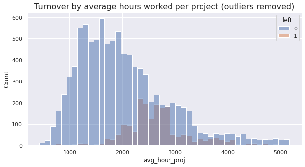
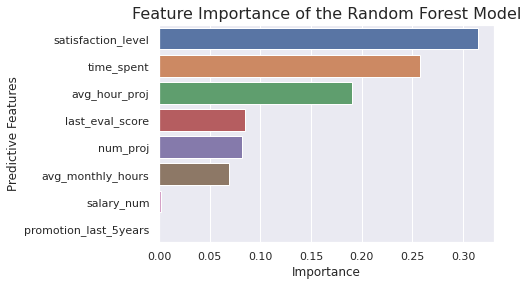

# Employee Turnover Prediction Project
This is the capstone project of Google Advanced Data Analytics specialization, a seven-course hands-on program on data analytics and data science. 
The capstone project incorporates skills and tasks spanning the entire Google Advanced Data Analytics Certificate, including creating a project proposal, carrying out EDA, feature engineering, hypothesis testing, building statistic data models and machine learning models, and presentation to the stakeholders.
## Project Overview
The Salifort Motor leadership team has asked for a model to predict employee turnover, using data collected from a HR survey. If we could predict whether an employee will leave the company, and discover the reasons behind their departure, we could better understand the problem and develop a solution. The final random forest model performed with 99% accuracy and 93% recall determining what features were most important in separating employee who left from employee who stayed. Based on the model, the satisfaction level, time spent with the company, and average hours worked per project were most influential in determining whether an employee would leave the company. 
## Business Understanding
An employee turnover prediction model can be used by corporate organization in two ways. The first is bottom-up, where the model is used to predict if certain individuals (e.g. high potential employees, etc.) are likely to leave the company and the company can proactively engage with the employees to prevent turnover. The other way the model can be used is top-down, where insights from the model, such as feature importance, can help the organization implement measures to improve employee retention across the entire organization. However, this requires that the model is interpretable to certain extent.
## Data Understanding
The HR survey dataset came from [Kaggle](https://www.kaggle.com/datasets/mfaisalqureshi/hr-analytics-and-job-prediction?select=HR_comma_sep.csv) The data consisted of 14,999 rows and 10 columns. After de-duplication the number of rows is reduced to 11,991. The features include anonymous information on the employee's job satisfaction, tenure with the company, average monthly hours and salary levels, among others. 
The plots below show the histogram of employee turnover  (left = 1, or 0) by the satisfaction level, the time in years employeed by the company, and the average hours worked per project, respectively. The last feature is an engineerd feature based on total number of projects, average monthly working hours, and years employed.

Prior to modelling, categorical variables are encoded whenver necessary, and features deemed irrelevant (though hypothesis testing) are dropped.
## Modeling and Evaluation
A logistic regression model and a random forest model with 4-fold cross validation were constructed to predict employee turnover. The recall rate was chose as the refit parameter in both models, as it's important to minize false negatives (employees who have left the company but are predicted as stayed by the model) in this business context. 
The random forest model performed very well to predict employee turnover, with an accuracy of 99%, and a recall of 93%. In contrast, the logistic model achieved an accuracy of 81% and a recall of 87%.
The plot below shows that the employee's satisfaction level, time spent with the company, and average hours worked per project were the top three most important features in determining an employee who has left the company from one that stayed.

## Conclusion
